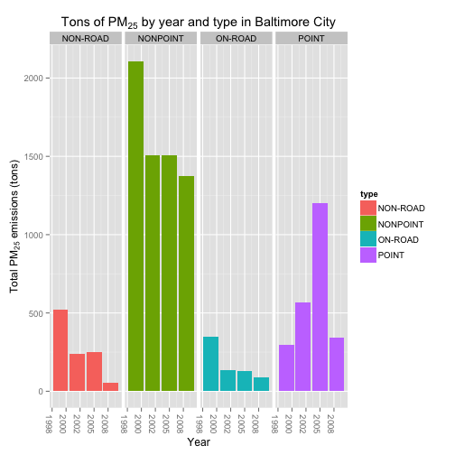
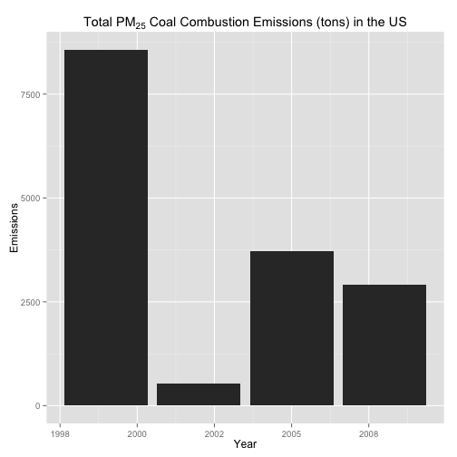
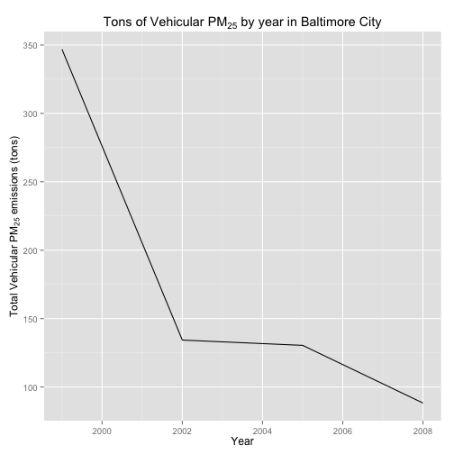
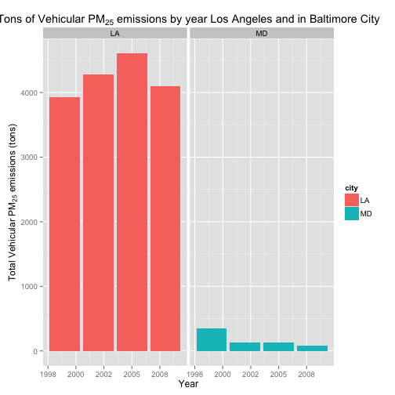

### Introduction
Fine particulate matter (PM2.5) is an ambient air pollutant for which there is strong evidence that it is harmful to human health. In the United States, the Environmental Protection Agency (EPA) is tasked with setting national ambient air quality standards for fine PM and for tracking the emissions of this pollutant into the atmosphere. Approximately every 3 years, the EPA releases its database on emissions of PM2.5. This database is known as the National Emissions Inventory (NEI). You can read more information about the NEI at the [EPA National Emissions Inventory web site](http://www.epa.gov/ttn/chief/eiinformation.html).

For each year and for each type of PM source, the NEI records how many tons of PM2.5 were emitted from that source over the course of the entire year. The data that used in this assignment are for 1999, 2002, 2005, and 2008.

### Data

The data for this assignment are available from the course web site as a single zip file:

[Data for Peer Assessment](https://d396qusza40orc.cloudfront.net/exdata%2Fdata%2FNEI_data.zip) [29Mb]  
The zip file contains two files:

PM2.5 Emissions Data (```summarySCC_PM25.rds```): This file contains a data frame with all of the PM2.5 emissions data for 1999, 2002, 2005, and 2008. For each year, the table contains number of tons of PM2.5 emitted from a specific type of source for the entire year. 

Source Classification Code Table (```Source_Classification_Code.rds```): This table provides a mapping from the SCC digit strings int he Emissions table to the actual name of the PM2.5 source. 


```r
## Load required packages, and read the data into the curent workspace
packages<-c("data.table", "dplyr", "reshape2", "ggplot2", "Hmisc")
sapply(packages, require, character.only = TRUE)
```

```
## data.table      dplyr   reshape2    ggplot2      Hmisc 
##       TRUE       TRUE       TRUE       TRUE       TRUE
```

```r
# function getdata() checks for the existence of a directory containing a file to 
# be downloaded, and if it is not present, downloads a linked file and stores it 
# in a directory in the current workspace. 
#
# input: a URL linked to a file to be downloaded, desired name for the 
#        directory, desired name for the downloaded file, extension for the 
#        file. 
# output : the path to the downloaded file
getdata<-function(fileUrl, dir, filename, ext){
        # create directory, if it is not already present
        dirName<-paste(dir, sep = "")
        if(!file.exists(dirName)){
                dir.create(path = dirName)
        }
        # Get the data, unless this step has already been done
        dest<-paste("./", dirName,"/", filename, ext, sep = "")
        if(!file.exists(dest)){
                download.file(url = fileUrl, 
                              destfile = dest, 
                              method = "curl") 
                datedownloaded<-date()
        }
        dest
}
fileURL<-"https://d396qusza40orc.cloudfront.net/exdata%2Fdata%2FNEI_data.zip"
temp<-getdata(fileUrl = fileURL, 
              dir = "ExDa2", 
              filename = "ExDAData",
              ext = ".zip")
epaData<-unzip(zipfile = temp)
if (!exists("NEI")){
        NEI <- readRDS("summarySCC_PM25.rds")
}
if(!exists("SCC")){
        SCC <- readRDS("Source_Classification_Code.rds")
}
```
1. Have total emissions from PM2.5 decreased in the United States from 1999 to 2008? Using the base plotting system, make a plot showing the total PM2.5 emission from all sources for each of the years 1999, 2002, 2005, and 2008.

The following code generates a barchart that displays the total tons of emissions by year. 


```r
# as a cleaning step, convert all column headers to lower case letters
colnames(NEI)<-tolower(colnames(NEI))
# melt the NEI data frame by year
meltedNEI<-melt(data = NEI, 
                id.vars = "year", 
                measure.vars = "emissions")
totalEmissionsByYear<-dcast(data = meltedNEI, 
                            formula = year~as.numeric(variable),
                            fun.aggregate = sum)
colnames(totalEmissionsByYear)<-c("year", "tons")
barplot(totalEmissionsByYear$tons, 
        names.arg = totalEmissionsByYear$year,
        main = expression("Tons of PM"[25]* " by year"), 
        xlab = "Year", 
        ylab = expression("Total PM"[25]* " emissions (tons)"))
```

 

2. Have total emissions from PM2.5 decreased in the Baltimore City, Maryland ```(fips == "24510")``` from 1999 to 2008? Use the base plotting system to make a plot answering this question.

This uses the same procedure as question 1, on the subset of NEI that contains only information for Baltimore City


```r
# subset the data to only include information for Baltimore City
baltimore<-NEI[NEI$fips=="24510",]
# melt the baltimore data frame by year
MeltedBaltimore<-melt(data = baltimore, 
                      id.vars = "year", 
                      measure.vars = "emissions")
baltimoreEmissions<-dcast(data = MeltedBaltimore, 
                          formula = year~variable, 
                          sum)
colnames(baltimoreEmissions)<-c("year", "tons")
barplot(baltimoreEmissions$tons, 
        names.arg = baltimoreEmissions$year, 
        main = expression("Tons of PM"[25]* " by year in Baltimore City"), 
        xlab = "Year", 
        ylab = expression("Total PM"[25]* " emissions (tons)"))
```

 

3. Of the four types of sources indicated by the type (point, nonpoint, onroad, nonroad) variable, which of these four sources have seen decreases in emissions from 1999–2008 for Baltimore City? Which have seen increases in emissions from 1999–2008? Use the ggplot2 plotting system to make a plot answer this question.


```r
# subset the data to only include information for Baltimore City
baltimore<-NEI[NEI$fips=="24510",]
# melt the baltimore data frame by year
MeltedBaltimore<-melt(data = baltimore, 
                      id.vars = c("year", "type"), 
                      measure.vars = "emissions")
baltimoreEmissions<-dcast(data = MeltedBaltimore, 
                          formula = year+type~variable, 
                          fun.aggregate = sum)
g <- ggplot(data = baltimoreEmissions, aes(x = year, y = emissions, fill=type))
g <- g + geom_bar( stat="identity", binwidth=1)
g <- g + facet_grid(.~type) 
g <- g + theme(axis.text.x = element_text(angle = -90, hjust = 1))
g <- g + labs(x= "Year", y = expression("Total PM"[25]* " emissions (tons)"), title = expression("Tons of PM"[25]* " by year and type in Baltimore City"))
g
```

 

4. Across the United States, how have emissions from coal combustion-related sources changed from 1999–2008?


```r
# preprocess SCC to make all names lower case, and to remove underscores and periods
colnames(SCC)<-tolower(names(SCC))
colnames(SCC)<-gsub(pattern = "\\.", "", x = names(SCC))
colnames(SCC)<-gsub(pattern = "_", "", x = names(SCC))
names(SCC)
```

```
##  [1] "scc"               "datacategory"      "shortname"        
##  [4] "eisector"          "optiongroup"       "optionset"        
##  [7] "scclevelone"       "sccleveltwo"       "scclevelthree"    
## [10] "scclevelfour"      "mapto"             "lastinventoryyear"
## [13] "createddate"       "reviseddate"       "usagenotes"
```

```r
# to find the cases where coal is used for combustion, look for where coal is the fuel (level 3) and the process is combustion (level 1)

matches<-intersect(
        grep("Coal", SCC$scclevelthree), 
        grep("Combustion", SCC$scclevelone)
        )
sccVals<-SCC$scc[matches]
# obtain scc matches in NEI
coalNEI<-NEI[NEI$scc==sccVals,]
```

```
## Warning: longer object length is not a multiple of shorter object length
## Warning: longer object length is not a multiple of shorter object length
```

```r
# melt the coalNEI dataframe by year
melted_coalNEI<-melt(data = coalNEI, 
                     id.vars = "year", 
                     measure.vars = "emissions")
total_coal_NEI<-dcast(data = melted_coalNEI, 
                      formula = year~variable, 
                      fun.aggregate = sum)
gg<-ggplot(data = total_coal_NEI, aes(x = year, y = emissions))
gg<-gg + geom_bar( stat="identity", binwidth=1)
gg +  labs(x= "Year", y = "Emissions", title = expression("Total PM"[25]* " Coal Combustion Emissions (tons) in the US"))
```

 

5. How have emissions from motor vehicle sources changed from 1999–2008 in Baltimore City?


```r
matches<-grep("[Vv]ehicle", SCC$eisector)
sccVals<-SCC$scc[matches]
# obtain scc matches in NEI
allVehicles<-NEI[which(NEI$scc %in% sccVals),]
baltimoreVehicles<-allVehicles[allVehicles$fips=="24510",]
meltBV<-melt(data = baltimoreVehicles, id.vars = "year", measure.vars = "emissions")
castBV<-dcast(data = meltBV, formula = year~variable, sum)
qplot(x = year, y = emissions, data = castBV , geom = "line", xlab = "Year", ylab = expression("Total Vehicular PM"[25]* " emissions (tons)"), main = expression("Tons of Vehicular PM"[25]* " by year in Baltimore City"))
```

 

6. Compare emissions from motor vehicle sources in Baltimore City with emissions from motor vehicle sources in Los Angeles County, California (```fips == "06037"```). Which city has seen greater changes over time in motor vehicle emissions?


```r
matches<-grep("[Vv]ehicle", SCC$eisector)
sccVals<-SCC$scc[matches]
# obtain scc matches in NEI
allVehicles<-NEI[which(NEI$scc %in% sccVals),]
twoCityData<-allVehicles[allVehicles$fips=="24510"|allVehicles$fips=="06037",]
melted_twoCityData<-melt(data = twoCityData, id.vars = c("fips", "year"), measure.vars = "emissions")
cast_twoCityData<-dcast(data = melted_twoCityData, formula = fips+year~variable, fun.aggregate = sum)
cast_twoCityData$city<-ifelse(test = cast_twoCityData$fips=="06037", yes = "LA", no = "MD")
g <- ggplot(data = cast_twoCityData, aes(x = year, y = emissions, fill=city))
g <- g + geom_bar( stat="identity", binwidth=1)
g <- g + facet_grid(.~city) 
g <- g + labs(x= "Year", y = expression("Total Vehicular PM"[25]* " emissions (tons)"), title = expression("Tons of Vehicular PM"[25]* " emissions by year Los Angeles and in Baltimore City"))
g
```

 
